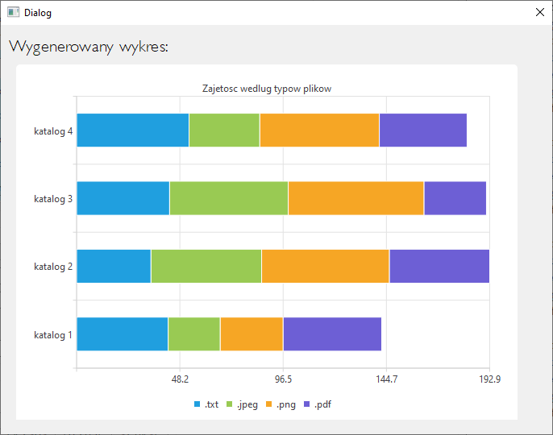
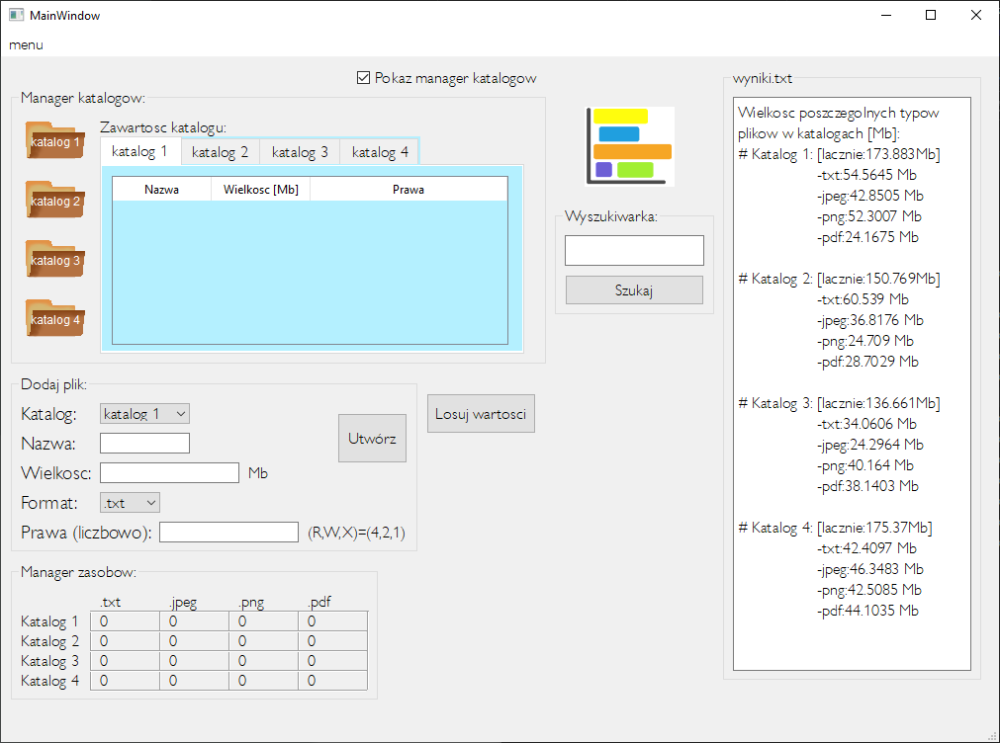

PL project

# Użyte technolowie/środowisko:
 - QtCreator,
 - C++,
 - OOP (Object Oriented Programming),

# Funkcje pojektu:
 -  Praca w trybie okna,
 - Symulowanie tworzenia plików w systemie operacyjnym z atrybutami typowymi dla nich (nazwa, wielkość, format, prawa dostępu),
 - Umieszczanie wygenerowanych danych (rekordów) w odpowiednich katalogach (odpowiednio 1,2,3,4),
 - Generowanie dynamicznych statystyk dla folderów względem wielkości wygenerowanych/zapisanych plików oraz formatów plików,
 - Tworzenie tabeli z wartościami wielkości danych typów plików w poszczególnych katalogach,
 - Eksport podsumowania wygenerowanych/zapisanych danych,
 - Możliwość zapisu przez użytkownika danych do wybranych plików z wybranymi parametrami,
 - Ukrycie zawartości katalogów,
 - Zakończenie pracy programu z poziomu elementu menu,
 - Wyszukiwanie po nazwie w zapisanych rekordach (wyszukiwarka),

# Sposób uruchomienia:
Aby uruchomić projekt należy uruchomić plik .exe z lokalizacji /release, gdzie znajdują się pliki bibliotek oraz pliki generowane przez program.

# Praca na kodzie źródłowym
Aby rozpocząć pracę na kodzie źródłowym projektu należy zaimportować projekt z folderu "/OperatingSystem" do środowiska QtCreator skonfigurowanego dla edycji i kompilacji kodu C++ (najlepiej kompilator "Qt 6.1.2 MinGw 64-bit" lub podobny).